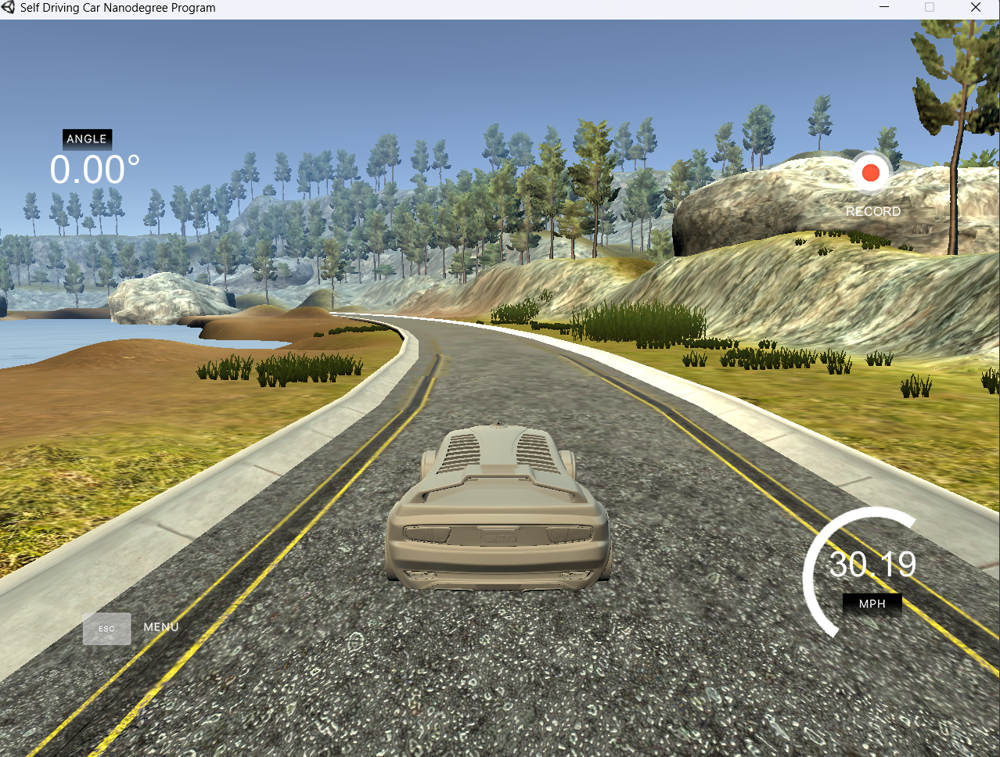
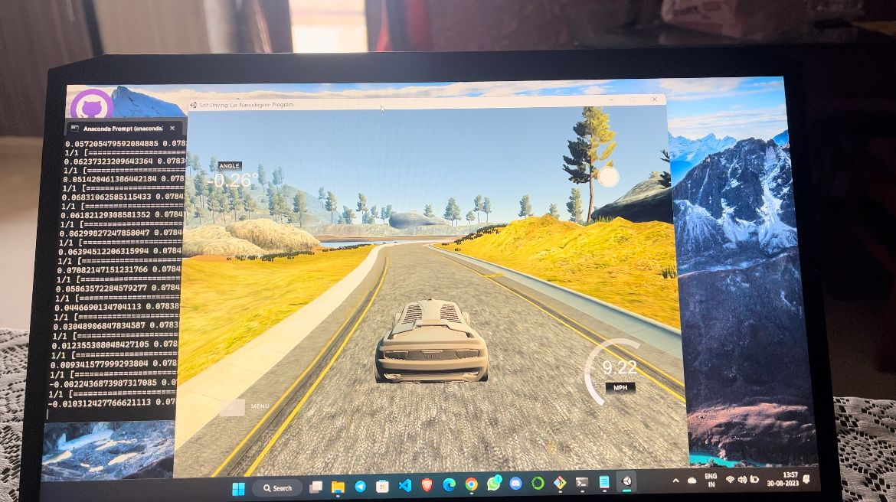

# Self driving car based on nvdia research paper

- Based on the nvidia research paper 'End to End Learning for Self-Driving Cars' this project is implemented as described by the nvdia, here udacity car simulater was used to collect the data(images, steering angle, throttle, speed up and down) this data is saved in the csv file.
- As we link images to steering angle we train the model but before this we performed various preprocessing techniques on the given images
- Then we train the model on the given dataset
- after words we created an app to link the udacity car to the trained data so that it can drive itself
